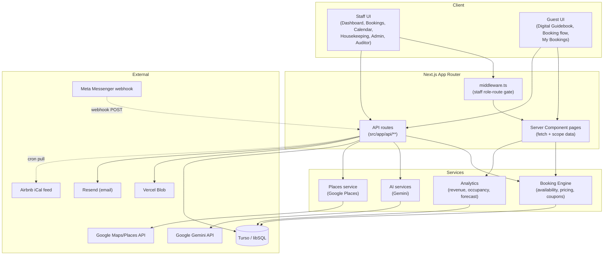
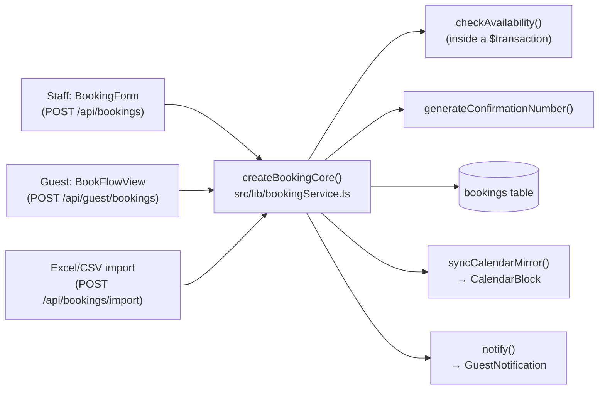

# Architecture

> Part of the [Evangelina's Staycation documentation](README.md).

- [Tech stack](#tech-stack)
- [System overview](#system-overview)
- [Two separate auth systems](#two-separate-auth-systems)
- [Request flow](#request-flow)
- [The Booking Engine](#the-booking-engine)
- [Caching strategy](#caching-strategy)
- [Client/server code-splitting rule](#clientserver-code-splitting-rule)

## Tech stack

| Layer | Technology |
|---|---|
| Framework | Next.js 14 (App Router), React 18, TypeScript |
| Styling | Tailwind CSS |
| Database | Turso (libSQL/SQLite), via Prisma ORM with driver adapters |
| Staff auth | NextAuth v4, Credentials provider, JWT session strategy |
| Guest auth | Custom JWT session system (separate from NextAuth) |
| File/image storage | Vercel Blob (guest payment proofs, housekeeping photos) |
| Email | Resend |
| AI | Google Gemini (`gemini-flash-latest`) — guest AI Concierge, payment-proof vision verification, host-voice place blurbs |
| Maps/Places | Google Maps JavaScript API + Google Places API |
| Deployment | Vercel |
| Validation | Zod (schemas in `src/lib/validation.ts`) |

## System overview

## Two separate auth systems

A deliberate architectural decision, not an oversight — staff and guests **share no session, no cookie, and no code path**, so guest-facing work can never regress staff login:

| | Staff | Guest |
|---|---|---|
| Library | NextAuth v4 | Hand-rolled |
| Identity | `User` model — username + bcrypt password | `Guest` model — email only, no password |
| Session mechanism | NextAuth JWT, cookie `next-auth.session-token` | Custom JWT (`GUEST_SESSION_SECRET`), cookie `guest-session-token` |
| Sign-in | Username/password form (`/login`) | Magic link **or** email + booking confirmation number (`/guest-login`) |
| Route protection | `src/middleware.ts` (`withAuth`) — role→route table, redirects | Per-route `getCurrentGuest()` check inside each guest API route/page |
| Authorization model | Role-based (`OWNER_ADMIN`/`CO_OWNER`/`HOUSEKEEPING`/`BOOKER`/`AUDITOR`) + per-unit ownership scoping | Row ownership only (`Booking.guestId === session.guestId`) |

See [Guest-Portal.md](Guest-Portal.md) and [Admin-Portal.md](Admin-Portal.md) for the full detail of each.

## Request flow

**Staff page load** (e.g. `/bookings`):
1. `middleware.ts` checks the NextAuth JWT's `role` claim against a hardcoded route→role table; redirects to `/login` or `/` if not permitted.
2. The page's Server Component (`src/app/bookings/page.tsx`) calls `requireUser()`/`getCurrentUser()`, then queries Prisma directly with an explicit `select` and role-based `unitWhere()` scoping.
3. Data is JSON round-tripped (`JSON.parse(JSON.stringify(...))`) into a Client Component (`BookingsView.tsx`) that owns all interactivity; further writes go through `fetch()` calls to `src/app/api/**/route.ts` handlers, which re-validate auth/role/ownership independently of the UI (so a direct API call can't bypass what the page hides).

**Guest page load** (e.g. `/my-bookings/[id]`):
1. No middleware gate — `/`, `/guide/*`, `/book`, `/guest-login` are intentionally reachable unauthenticated (middleware special-cases these).
2. The page calls `getCurrentGuest()` (reads/verifies the guest JWT cookie) and, if present, fetches that guest's own data by `guestId`-scoped Prisma queries.
3. Sensitive per-booking fields (WiFi password, door code) are **not** included in the server→client payload at all — they're fetched separately, after the guest re-enters their booking confirmation number, via `/api/guest/wifi` and `/api/guest/door-code`. See [Security.md](Security.md#wifidoor-code-reveal-gate).

**Every API route**, staff or guest, independently:
1. Authenticates (`requireUser([...roles])` or `getCurrentGuest()`).
2. Authorizes (role check, then row-ownership check — `isUnitInScope()` for staff, `guestId` match for guests).
3. Validates the request body with a Zod schema (`src/lib/validation.ts`).
4. Performs the write inside a `$transaction` where a race condition is possible (e.g. booking creation/edit re-checks availability inside the same transaction as the insert).
5. Writes an `AuditLog` row for state-changing staff actions.

## The Booking Engine

`src/lib/bookingEngine/` and `src/lib/pricing/` are the shared core used by **both** the staff manual-booking form and the guest self-service flow — there is exactly one booking-creation code path (`createBookingCore` in `bookingService.ts`), not two parallel implementations:

Pricing (`src/lib/pricing/rates.ts`) is likewise centralized: a single `quotePrice()` function, driven entirely by `Settings` rate-table fields (never hardcoded), used by both the guest booking-quote endpoint and the staff form's live quote. See [Booking.md](Booking.md) for the actual rate/promo rules.

## Caching strategy

- `unstable_cache` (Next.js) wraps a handful of read-heavy, slow-changing queries — `getCachedBookingSettings()`, `getCachedActiveUnits()`, `getCachedGuidebookCore()` — with short revalidation windows (60s).
- **Base64/photo fields are deliberately excluded from any cached payload.** Next's data cache has a 2MB per-entry limit; a cached query that includes a base64 photo column can silently fail to cache (or blow past the limit) once real photos are attached. The established pattern: fetch the cheap/cacheable scalar fields inside the cached function, then merge in photo fields via a small **uncached** follow-up query. Used by the guidebook host/team photos and was the fix for a real production incident on the leaderboard endpoint.
- Dashboard/Admin heavy reads use a **connection-pool round-robin** (`prismaPool[n]`) so a dozen-plus parallel `Promise.all` queries against Turso (an HTTP-based database) aren't serialized behind a single connection.

## Client/server code-splitting rule

Established the hard way (a real runtime bug during development): any file imported by **both** a Client Component and server-only code (Prisma, `process.env.SERVER_SECRET`) must contain **no server-only imports**, or Next.js silently bundles the entire server dependency chain (including `@prisma/client`) into the client JS bundle, which breaks at runtime with an opaque "Element type is invalid" error.

The fix is a consistent split: `xContent.ts` (plain data/constants, safe for client import) vs. `xService.ts` (Prisma-touching, server-only). Examples: `guidebookContent.ts`/`guidebookService.ts`, `feedbackContent.ts`/`feedbackService.ts`, `placeInsightFormat.ts`/`placeEditorial.ts` (client-safe) vs. `placeInsightService.ts`/`googlePlacesClient.ts` (server-only).
