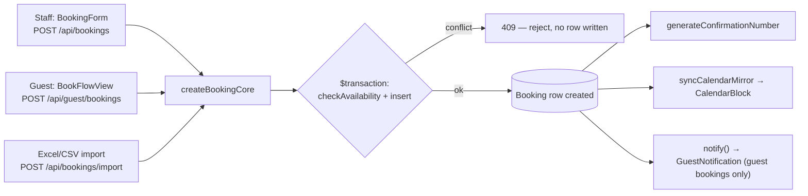
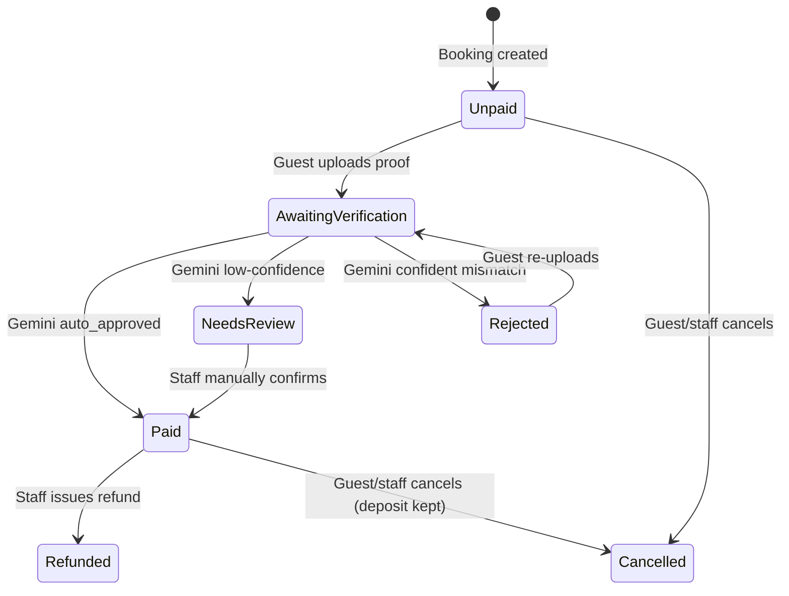
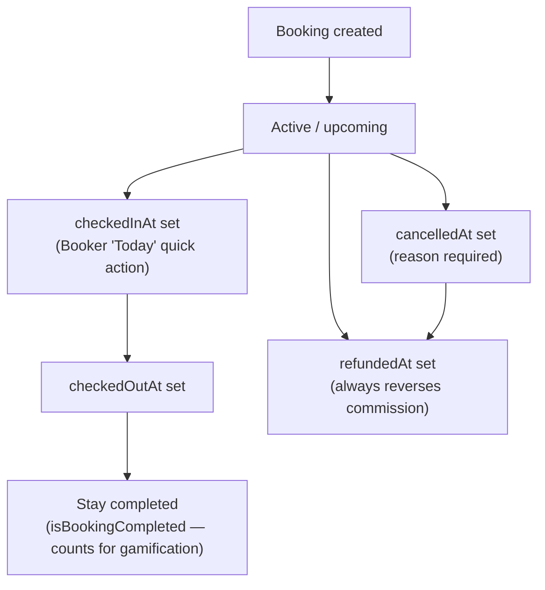

# Booking Workflow

> Part of the [Evangelina's Staycation documentation](README.md). Pricing/commission/cancellation rules live in [Business-Rules.md](Business-Rules.md) — this document covers the end-to-end workflow and data lifecycle.

- [Creation paths](#creation-paths)
- [Guest self-service booking flow](#guest-self-service-booking-flow)
- [Staff manual booking](#staff-manual-booking)
- [Bulk import](#bulk-import)
- [Availability checking](#availability-checking)
- [Calendar mirroring](#calendar-mirroring)
- [Payment lifecycle](#payment-lifecycle)
- [Confirmation number validity](#confirmation-number-validity)
- [Booking lifecycle diagram](#booking-lifecycle-diagram)

## Creation paths

All three creation paths funnel through **one shared function**, `createBookingCore()` in `src/lib/bookingService.ts` — there is no separate/duplicated booking-insert logic anywhere:

Wrapping the availability re-check and the insert in the **same transaction** matters: without it, two near-simultaneous requests for the same unit/date/stay-type could both pass their own availability check before either one's insert commits, producing a real double-booking. The transaction serializes that read-then-write sequence.

## Guest self-service booking flow

`src/components/guest/BookFlowView.tsx`, single-page state machine: **search → select unit → details → payment → done**. No page redirects between steps.

1. **Search/select**: `GET /api/guest/booking-quote` returns real-time availability + a server-computed price quote for every active unit, for the chosen date/stay type.
2. **Details**: guest enters name/email/phone/pax/special request, picks **full payment** or **down payment**, optionally enters a coupon code (re-validated via `GET /api/guest/coupon-check`).
3. Submission (`POST /api/guest/bookings`) re-validates everything server-side — **never trusts a client-supplied price**: the quote is recomputed fresh from `Settings` at submit time. On success, the guest is **signed in immediately** (a session cookie is minted in the same response) — no separate email round-trip needed to reach the payment step.
4. **Payment**: guest uploads a payment screenshot inline (`POST /api/guest/bookings/[id]/payment-proof`) — magic-byte validated, then checked by Gemini Vision (see [Integrations.md](Integrations.md#google-gemini)). Outcome is one of `auto_approved` (only outcome that ever writes `dpAmount`/`paid`), `needs_review` (a human must look — never silently accepted), or `rejected` (with a specific reason).
5. **Done**: confirmation number shown, a confirmation email sent (best-effort — never blocks the response), and the guest can immediately view `/my-bookings/[id]`.

## Staff manual booking

`src/components/bookings/BookingForm.tsx` → `POST /api/bookings` → `createBookingRecord()` (a thin wrapper around `createBookingCore` that adds a unit-scope check for Co-owners and an audit log entry). Same Zod schema (`bookingSchema`) as every other creation path — staff doesn't get a looser validation just because it's an internal form.

## Bulk import

`POST /api/bookings/import` (`src/lib/bookingImport.ts`) — accepts `.xlsx`/`.xls`/`.csv`, max 20MB / 2000 rows. Each row is transformed and validated independently (`transformRow`), then created **sequentially** (not in parallel) by calling the same `createBookingRecord()` staff path — sequential specifically so a row can be correctly rejected as conflicting with a booking created earlier in the *same* file. A bad row is skipped with a stated reason; one bad row never fails the whole import.

## Availability checking

`src/lib/bookingEngine/availabilityService.ts` (`checkAvailability`) — checks for a time-range overlap against existing bookings on the same unit, respecting each stay type's actual occupied window (`src/lib/stayRange.ts`'s `occupiedRange`/`bookingsConflict`, which understands that a Flexible stay's real conflict window is its chosen check-in/out time, not a fixed 12/21-hour block). Used identically by booking creation, booking editing, and the guest quote/availability endpoints.

## Calendar mirroring

A `Booking` doesn't render on `/calendar` directly — `syncCalendarMirror()` (`src/lib/calendarMirror.ts`) keeps a matching `CalendarBlock` row in sync (`Booking.calendarBlock`, a unique 1:1 relation) on every create/edit/cancel/delete, so the calendar always reflects the booking's current date span and stay type without the calendar query needing to re-derive that logic itself.

## Payment lifecycle

`amount` is always the full amount currently owed; `dpAmount` means "actually collected," never "intended" — see [Business-Rules.md](Business-Rules.md#down-payment) for why that distinction is load-bearing for revenue reporting.

## Confirmation number validity

See [Business-Rules.md](Business-Rules.md#booking-id-confirmation-number-validity) for the rule itself. Enforced identically (via one shared `isConfirmationValid()` function) at three separate checkpoints, so they can never drift out of sync:

1. `POST /api/guest/auth/verify-confirmation` — guest login
2. `POST /api/guest/wifi` — WiFi credential reveal
3. `POST /api/guest/door-code` — door code reveal

## Booking lifecycle diagram

