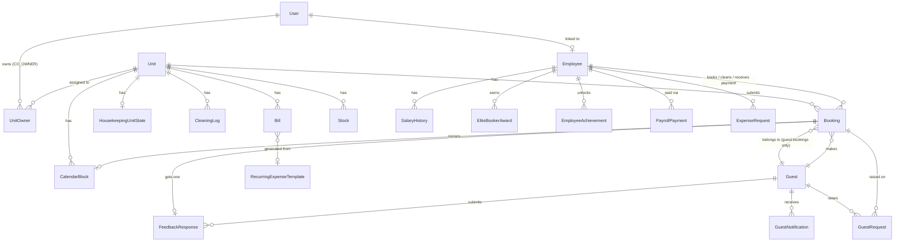

# Database

> Part of the [Evangelina's Staycation documentation](README.md).

- [Provider & connection](#provider--connection)
- [The JSON-in-TEXT pattern](#the-json-in-text-pattern)
- [Entity-relationship overview](#entity-relationship-overview)
- [Models](#models)
- [Indexes](#indexes)
- [Migrations](#migrations)

## Provider & connection

**Turso (libSQL — a SQLite-compatible distributed database)**, accessed through Prisma's `driverAdapters` preview feature (`prisma-client-js` + `@prisma/adapter-libsql`).

```prisma
datasource db {
  provider = "sqlite"
  url      = env("DATABASE_URL")
}
```

Connection needs two env vars: `DATABASE_URL` (a `libsql://...` URL) and `TURSO_AUTH_TOKEN`. See `src/lib/prisma.ts` for how the client is constructed and [Configuration.md](Configuration.md) for the full env var list.

There is **no Postgres/Neon database in active use**, despite `NEON_DATABASE_URL`/`NEON_DIRECT_URL` existing as unused entries in `.env.local` and the root `docker-compose.yml`/`README.md` describing a Postgres setup — see [Folder-Structure.md](Folder-Structure.md#known-inaccuracies-in-root-level-files). Confirmed by grep: nothing in `src/` or `prisma/` references `NEON_DATABASE_URL`.

## The JSON-in-TEXT pattern

SQLite/libSQL (under Prisma's driver-adapter mode) supports neither native arrays nor a `Json` column type. Every field that's conceptually an array or object is stored as a `String` column holding JSON text, and transparently converted at the ORM boundary by a **Prisma Client Extension** in `src/lib/prisma.ts`:

- A `query`-level extension **stringifies** these fields on every `create`/`update`/`upsert` write.
- A `result`-level extension **parses** them back on every read.

Application code everywhere else reads/writes these fields as plain arrays/objects — the JSON encoding is invisible outside `prisma.ts`. Fields using this pattern (must be registered in **both** the write-side and read-side blocks of the extension, or a new field will silently stay a raw JSON string on one side):

`Booking.guests`, `HousekeepingUnitState.checked`/`cleanedBookingIds`/`photoUrls`, `CleaningLog.photoUrls`, `Settings.checklistGroups`/`guidebookCategories`/`amenities`/`houseRules`/`celebrationPackageItems`/`emergencyContacts`/`staffContacts`/`faqs`, `AuditLog.meta`, `FeedbackResponse.likedTags`, `PlaceInsight.openingHours`.

## Entity-relationship overview



*(Simplified — some FK-only relations and every join to `User`/`Employee` as an approver/receiver are omitted for readability. Full detail in [Models](#models) below and in `prisma/schema.prisma` itself.)*

## Models

26 models total. Grouped here by domain; `@@map(...)` names are the actual SQLite table names.

### Staff & access control

| Model | Table | Purpose |
|---|---|---|
| `User` | `users` | Staff login account. `role` is one of `OWNER_ADMIN`, `CO_OWNER`, `HOUSEKEEPING`, `BOOKER`, `AUDITOR` (see [Business-Rules.md](Business-Rules.md#roles--permissions)). `passwordHash` via bcrypt. `showOnGuestGuide` opt-in for the guidebook's "Meet our team" card. |
| `UnitOwner` | `unit_owners` | Join table: which units a `CO_OWNER` can see. `@@unique([userId, unitId])`. |
| `Employee` | `employees` | Staff directory (Booker/Cleaner/Received-by picker options). Optionally linked to a `User` (`userId`) for staff who also log in. Carries `salaryType`/`salaryRate`/`monthlySalary` for payroll. |
| `SalaryHistory` | `salary_history` | Append-only log of `Employee.monthlySalary` changes, so past payroll periods use the rate that was actually in effect then. |

### Units & booking core

| Model | Table | Purpose |
|---|---|---|
| `Unit` | `units` | One of the 5 rental units. Nightly rate, photo, Airbnb iCal token/import URL, and Guest Experience per-unit fields (`wifiSsid`, `wifiPassword`, `doorCode`, check-in/out instructions, video tutorial URL). |
| `Booking` | `bookings` | The central model — see [Booking.md](Booking.md) for the full field-by-field business meaning (stay type, payment/down-payment, cancellation vs. refund, Airbnb sync fields, `confirmationNumber`/`confirmationOverrideUntil`, coupon snapshot, AI payment-verification result). `unit` relation is `onDelete: Restrict` — a unit with booking history can't be deleted. |
| `CalendarBlock` | `calendar_blocks` | Mirrored occupancy entry that actually renders on `/calendar` — kept in sync with `Booking` (reservation) and with in-progress cleans (`bookingId`/`cleaningBookingId`, both unique FKs back to `Booking`). |
| `IcalSyncLog` | `ical_sync_log` | One row per Airbnb iCal sync attempt (cron or manual), powering the Calendar page's Sync History panel. |

### Housekeeping

| Model | Table | Purpose |
|---|---|---|
| `HousekeepingUnitState` | `housekeeping_unit_state` | Current live status per unit (`todo`/`cleaning`/`clean`), checklist progress (`checked`), which bookings' checkouts have been cleaned this cycle, and in-progress photo staging. |
| `CleaningLog` | `cleaning_logs` | Permanent record of a completed clean — start/end time, photos, which booking's checkout it satisfied. Feeds payroll. `unit` relation is `onDelete: Restrict`. |
| `Shift` | `shifts` | Clock-in/clock-out record, linkable to an `Employee` or `User`. |
| `Stock` | `stocks` | Per-unit supply counts (towels, toiletries, etc.). |

### Financial

| Model | Table | Purpose |
|---|---|---|
| `Bill` | `bills` | A monthly operating expense (utility, rent, custom) per unit or shared. `amountDueCentavos`/`amountPaidCentavos` for template-generated bills (centavo precision); `amountDue`/`amountPaid` (whole pesos) for legacy/manual bills. |
| `RecurringExpenseTemplate` | `recurring_expense_templates` | Source of truth for a recurring monthly bill — the monthly generator creates exactly one `Bill` per template per month. |
| `WeeklyExpense` | `weekly_expenses` | Manually-logged cost, optionally charged against a specific staff member's pay (payroll deduction) or untargeted (e.g. TikTok ad spend, hits Net Profit only). |
| `ExpenseRequest` | `expense_requests` | Employee-submitted expense (TikTok ads or unit-specific), pending Admin approval before it affects profit/payroll. |
| `PayrollPayment` | `payroll_payments` | Record-only marker of whether a given week's payroll was actually handed to an employee. `@@unique([employeeId, periodStart])`. |
| `EliteBookerAward` | `elite_booker_awards` | Monthly booking-count milestone bonus with limited slots per tier — see [Business-Rules.md](Business-Rules.md#elite-booker-challenge). |
| `EmployeeAchievement` | `employee_achievements` | Owner-configurable per-employee milestone badge/bonus. |

### Guest Portal (guest-authenticated account system)

| Model | Table | Purpose |
|---|---|---|
| `Guest` | `guests` | Guest account — email-only identity, no password. Deliberately separate from `User` (see [Guest-Portal.md](Guest-Portal.md#why-a-separate-auth-system)). |
| `GuestLoginToken` | `guest_login_tokens` | One-time-use magic-link token (15 min TTL). Custom table instead of NextAuth's email-provider adapter, to avoid migrating staff auth onto adapter-based sessions. |
| `GuestRequest` | `guest_requests` | Guest → staff request from the Digital Guidebook (housekeeping, late checkout, extend stay, report an issue). |
| `GuestNotification` | `guest_notifications` | In-app inbox entries fired by `notificationService.notify()` (booking created/updated/cancelled, payment received). |
| `FeedbackResponse` | `feedback_responses` | Post-stay survey response + reward voucher. `bookingId` is `@unique` — one response per stay, enforced at the DB level. |
| `AssistantEscalation` | `assistant_escalations` | A guest tapping "Talk to a human" in the AI Concierge, or the assistant declining to answer. |
| `Coupon` | `coupons` | Admin-managed discount code for the Guest Portal booking flow. A booking's actual discount is a denormalized snapshot on `Booking.couponCode`/`couponDiscountAmount`, so editing/deleting a `Coupon` never rewrites history. |

### Guest Experience content & Places

| Model | Table | Purpose |
|---|---|---|
| `Settings` | `settings` | Singleton (`id = 1`) site-wide config — business info, rate table, payroll rates, Guest Experience content overrides (categories/amenities/house rules/FAQs/contacts), property lat/lng. See [Configuration.md](Configuration.md). |
| `PlaceInsight` | `place_insights` | One row per `(category, name)` nearby place — real Google Places data (distance, rating, hours, photo reference, walk/drive time) refreshed on demand from Admin, never on a schedule. See [Integrations.md](Integrations.md#google-places-api). |

### Audit & misc

| Model | Table | Purpose |
|---|---|---|
| `AuditLog` | `audit_log` | Append-only staff action trail (`action`, `entity`, `entityId`, `meta` JSON). Powers `/auditor`. |
| `AuditFinding` | `audit_findings` | Auditor-logged quality inspection finding (cleaning/laundry/booking score, severity, follow-up flag). |
| `DismissedAttentionItem` | `dismissed_attention_items` | Tracks which Dashboard "Needs your attention" cards a staff member dismissed, fingerprinted by content so a genuinely new instance of the same issue type reappears. |

## Indexes

Every non-trivial `findMany`/`findFirst` filter path in the codebase has a matching index. From `schema.prisma`:

| Model | Index | Serves |
|---|---|---|
| `Booking` | `[unitId, date]`, `[date]` | Calendar/availability queries |
| `Booking` | `[bookerId]`, `[cleanerId]` | Commission/payroll queries (My Earnings, Leaderboard, Analytics → Staff) |
| `Booking` | `[guestId]` | Every Guest Portal booking lookup (list, detail, cancel, payment-proof, request) |
| `Booking` | `[unitId, externalUid]` unique | Airbnb iCal dedup |
| `Booking` | `confirmationNumber` unique | Guest login by confirmation number, door-code/WiFi reveal |
| `CalendarBlock` | `[unitId, date]` | Calendar rendering |
| `IcalSyncLog` | `[startedAt]`, `[unitId, startedAt]` | Sync History panel |
| `Employee` | `[active]` | Staff pickers |
| `SalaryHistory` | `[employeeId, effectiveDate]` | Historical payroll lookups |
| `WeeklyExpense` | `[date]`, `[category, date]` | Weekly report |
| `ExpenseRequest` | `[status]`, `[employeeId]` | Approval queue, employee's own list |
| `EmployeeAchievement` | `[employeeId]` | Employee's badge list |
| `CleaningLog` | `[unitId, startedAt]`, `[employeeId]` | Payroll, cleaning history |
| `AuditFinding` | `[resolved, severity]` | Auditor follow-up queue |
| `PlaceInsight` | `[category, name]` unique, `[category]` | Nearby-places lookups by name/category |
| `AuditLog` | `[createdAt]`, `[action, createdAt]` | Auditor trail, filtered activity log |
| `FeedbackResponse` | `[guestId]`, `[unitId]` | Guest's own feedback, per-unit reporting |
| `GuestNotification` | `[guestId, createdAt]` | Guest notification inbox |
| `GuestRequest` | `[status, createdAt]` | Staff-facing open-requests queue |
| `GuestLoginToken` | `[email]` | Rate limiting / lookup during magic-link verify |

No index gaps were found against the query patterns actually used in the codebase as of this writing — see [Performance.md](Performance.md#database--query-review) for the full review.

## Migrations

**There is no `prisma/migrations/` directory and no migration history.** Schema changes in this project have been applied directly against the live Turso database with hand-written `ALTER TABLE`/`CREATE TABLE` scripts (via `@libsql/client`), followed by editing `schema.prisma` to match and running `npx prisma generate`. `package.json` defines `db:migrate` (`prisma migrate dev`) and `db:push` (`prisma db push`) scripts, but neither has actually been used to evolve this schema — confirmed by the absence of a migrations folder. See [Maintenance.md](Maintenance.md#schema-changes) for the actual working procedure.
